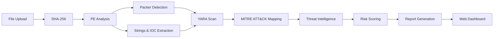

# ARES — Anti-Malware

<p align="center">
  <strong>ARES</strong> is a modern malware analysis and threat assessment platform for static file analysis, IOC extraction, YARA scanning, packer detection, and threat intelligence.
</p>

<p align="center">
  
  
  
  
  
  
</p>

> **ARES (Anti-Malware)** is built for authorized malware analysis, defensive security research, incident response, and threat hunting.

---

## ✦ Features

| Feature | Description |
|---|---|
| 🔬 **PE Analysis** | Inspects PE structure, sections, metadata, and suspicious imports. |
| 🛡️ **Packer Detection** | Detects common packers/protectors such as UPX, Themida, and VMProtect using signatures and entropy analysis. |
| 🧩 **IOC Extraction** | Extracts domains, IPs, URLs, registry keys, mutexes, cryptocurrency wallet addresses, and other indicators. |
| 📜 **YARA Engine** | Scans samples against `.yar` rules stored in the `rules/` directory. |
| 🎯 **MITRE ATT&CK** | Maps relevant analysis findings to ATT&CK techniques. |
| ⚠️ **Risk Scoring** | Produces a 0–100 risk score from `CLEAN` to `CRITICAL THREAT`. |
| 🌐 **Threat Intelligence** | Supports SHA-256 reputation lookups through VirusTotal and MalwareBazaar. |
| 📊 **Report Export** | Exports analysis results as JSON, CSV, TXT, and PDF. |
| 🖥️ **Web Interface** | Professional dark-themed UI with live analysis feedback and visual risk assessment. |

---

## ⚙️ Analysis Pipeline



---

## 📁 Project Structure

```text
ARES/
├── app.py
├── run.bat
├── run.sh
├── README.md
├── LICENSE
├── .gitignore
│
├── rules/
│   └── sample_rules.yar
│
├── templates/
│   └── index.html
│
├── assets/
│   └── hero.svg
│
├── docs/
│   └── screenshots/
│
└── ...analysis modules...
```

> The exact module names may vary depending on your implementation. Keep private/custom YARA rules out of the public repository when appropriate.

---

## 🔧 Configuration

| Setting | Purpose | Example |
|---|---|---|
| `VT_API_KEY` | VirusTotal API access | `your_api_key` |
| `MALWAREBAZAAR_API_KEY` | MalwareBazaar integration | `your_api_key` |
| `RULES_DIR` | YARA rules directory | `rules/` |
| `REPORT_DIR` | Generated report location | `reports/` |
| `MAX_FILE_SIZE` | Maximum sample size | `100MB` |
| `DEBUG` | Development/debug mode | `false` |

### Environment Variables

Create a `.env` file locally if your implementation uses environment variables:

```env
VT_API_KEY=your_virustotal_api_key
MALWAREBAZAAR_API_KEY=your_malwarebazaar_api_key
RULES_DIR=rules
REPORT_DIR=reports
DEBUG=false
```

**Never commit API keys, secrets, private samples, or sensitive YARA rules to GitHub.**

---

## 🚀 Getting Started

### 1. Clone the repository

```bash
git clone https://github.com/YOUR_USERNAME/ARES.git
cd ARES
```

### 2. Install dependencies

```bash
pip install -r requirements.txt
```

### 3. Add YARA rules

Place your `.yar` / `.yara` files inside:

```text
rules/
```

### 4. Configure integrations

Set the required environment variables for VirusTotal and MalwareBazaar if those integrations are enabled.

### 5. Start ARES

```bash
python app.py
```

Then open the local web interface shown by the application.

---

## 📈 Risk Classification

| Score | Classification |
|---:|---|
| `0–19` | 🟢 CLEAN |
| `20–39` | 🔵 LOW RISK |
| `40–59` | 🟡 SUSPICIOUS |
| `60–79` | 🟠 HIGH RISK |
| `80–100` | 🔴 CRITICAL THREAT |

> Risk scoring is an analytical indicator and should not be treated as definitive proof that a file is malicious.

---

## 📄 Reports

ARES can generate reports in:

- **JSON** — structured machine-readable output
- **CSV** — analysis data for spreadsheets and pipelines
- **TXT** — lightweight human-readable reports
- **PDF** — shareable analysis reports

---

## 🔐 Security & Responsible Use

ARES is intended for:

- Defensive malware analysis
- Authorized security research
- Incident response
- Threat hunting
- Malware triage
- Security education

Only analyze files you are authorized to handle. Use an isolated environment or sandbox when working with potentially malicious samples.

---

## 🤝 Contributing

Contributions are welcome.

1. Fork the repository.
2. Create a feature branch:
   ```bash
   git checkout -b feature/your-feature
   ```
3. Make your changes.
4. Test the changes locally.
5. Commit your work:
   ```bash
   git commit -m "Add: your feature"
   ```
6. Push the branch:
   ```bash
   git push origin feature/your-feature
   ```
7. Open a Pull Request.

For YARA rules, include clear rule names, useful metadata, and avoid submitting sensitive or proprietary samples.

---

## 🗺️ Roadmap

- [ ] Advanced PE anomaly detection
- [ ] Expanded packer/protector signatures
- [ ] More MITRE ATT&CK mappings
- [ ] Additional threat-intelligence providers
- [ ] Background analysis queue
- [ ] Authentication and user management
- [ ] Docker deployment
- [ ] API endpoint for automated analysis

---

## ⚖️ License

This project is provided for authorized defensive security research and analysis. See `LICENSE` for the applicable license terms.

---

<p align="center">
  <strong>ARES — Analyze. Detect. Understand.</strong>
</p>

---
## 📞 Contact

- Discord: <a href="https://discordapp.com/users/970282290905231390">@lumelisse</a>
- Discord: <a href="https://discordapp.com/users/219449504229752832">@Pokerface</a>
- Discord: <a href="https://discord.gg/MsxgXWA9Mt">@Server</a>
